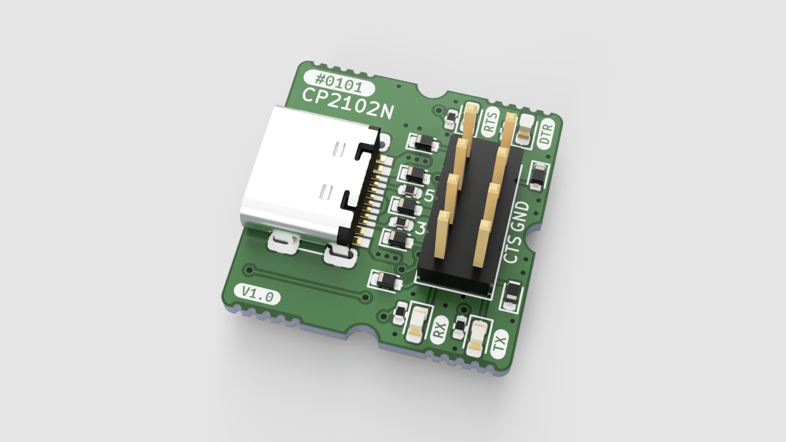

0101-SERIAL-CP2102N
==========

基于 CP2102N 的 USB-UART 转接器，并且附带 ESP32 兼容的自动烧录电路。

## 配置

SERIAL-CP2102N 背面预留了可配置的电路，可将 DTR/RTS 更改为用于 ESP32 自动烧录的 EN/IO0 功能。具体如下：

| 功能 | R8/R9 | Q1 |
|-----|-----|-----|
| 用作 DTR/RTS | 焊接 0Ω 0603 电阻 | 留空 |
| 用作 ESP32 烧录 | 留空 | 焊接 PUMH4,115 |

## 协议

[CERN-OHL-P-2.0](LICENSE)
